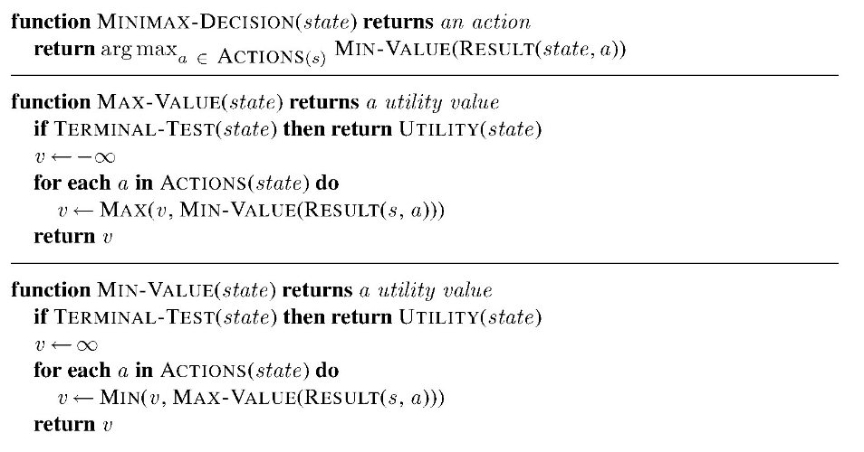

# Chess AI
## Jusung Park 
### COSC 76 Fall 2023
___

## Minimax and Cutoff Test
To implement the minimax algorithm, I followed the psuedocode provided by the textbook:



I implemented three functions:
- **choose_move**: This function orchestrates the decision-making process of the AI. It explores the game tree using minimax and alpha-beta pruning, considering various moves and their outcomes.
- **cutoff_test**: Checks whether maximum depth has been reached or whether the game has ended.
- **max_value**: This function represents the maximizing player's perspective in the minimax algorithm. It looks for the move that maximizes the AI's chances of winning.
- **min_value**: Conversely, this function represents the minimizing player's perspective. It aims to minimize the AI's chances of losing.
- **evaluate**: Determines the "value" of a given board state based on the material value of the pieces

I found that setting the max_depth level to 4 struck a balance between AI intelligence and response time. This choice is based on the time complexity of the algorithm, which is O(b^(2d)), where 'b' is the branching factor, and 'd' is the depth of the search. Going beyond a depth of 4 resulted in unreasonably long response times.

It's important to note that while the AI became more informed with higher depth levels, it still couldn't defeat a proficient human player. The limitation of the evaluation function, which only considered material values, restricted the AI's understanding of the game board.

Future improvements to the AI's evaluation function could include factors like king safety, control of the center of the board, and the freedom of the player's pieces. These additions would provide the AI with a more holistic view of the game.

## Iterative Deepening Search

 I implemented Iterative Deepening Search (IDS). IDS is a search strategy that gradually increases the depth of the search until a specified time limit is reached or the maximum depth is attained.

## Alpha-Beta Pruning

Alpha-Beta Pruning allowed the AI to explore fewer nodes in the game tree, resulting in faster decision-making.
The AlphaBetaAI was significantly faster compared to IDSMinimaxAI with the same level of depth.
When testing through the exact same moveset:
1. e4 Nh6 2. Qf3 Rg8 3. Bc4 Rh8 4. d4 Rg8 5. Bxh6 Rh8 6. Qxf7
I added a print function to print out the best move and their values every time a new best move was found. All the values for both IDSMinimaxAI and AlphaBetaAI were exactly the same, which indicated that the alpha-beta pruning was implemented correctly.
For the same depth limit, Alpha-Beta pruning consistently explored fewer nodes compared to Iterative Deepening. This result aligns with the expected behavior of Alpha-Beta pruning, which prunes branches early if it determines that they won't affect the final result. I also observed that Alpha-Beta pruning and Iterative Deepening provided moves leading to positions that satisfied the cutoff test (maximum depth reached) with the same value. This demonstrates that despite exploring fewer nodes, Alpha-Beta pruning did not compromise the quality of the chosen move. Both algorithms were able to identify moves of equal value at the same depth.

## Transposition Table

In `AlphaBetaAI2`, I implemented a `TranspositionTable` class to handle the storage and retrieval of cached positions. The class maintains a dictionary where the keys are hash values of chess board positions, and the values are tuples containing depth, value, and node type information. The `store` method adds entries to the table, while the `lookup` method retrieves cached entries.


```python
class TranspositionTable:
    def __init__(self):
        self.table = {}

    def store(self, board, depth, value, node_type):
        board_hash = hash(str(board))
        self.table[board_hash] = (depth, value, node_type)

    def lookup(self, board):
        board_hash = hash(str(board))
        if board_hash in self.table:
            return self.table[board_hash]
        return None
```

Implementing it into the alpha-beta pruning mechanism already programmed, the introduction of the transposition table serves in the following functions. Before evaluating a position during the search, the AI checks the transposition table for cached entries. If a cached entry exists and its depth is greater than or equal to the current search depth, the AI uses the cached value. Otherwise, it computes the value as usual and stores it in the transposition table.

The transposition table effectively prevents repeated calls for the same position during the search. Cached entries eliminate the need to reevaluate positions, leading to a substantial reduction in the number of calls made. Additionally, I messed around with various chess positions and search depths. I observed a notable decrease in the number of recursive calls made during the search process. This reduction directly correlates with the number of positions stored in the transposition table and reused during subsequent searches. Specifically, with the implementation of the table, I could play games with a depth of 7 where calculations took around less than a minute on average, something that would have taken far longer for the other AIs. Even more so, a depth of 8 resulted in a response in an average of 4.5 minutes, significantly faster than the previous iterations.


## Bonus

### Evaluation Functions
To make the AI more competitive and strategic, I enhanced the evaluation function by considering various criteria beyond material value. The additional heuristics include:
- **Control of the Center**: The AI now values control of the center of the board, recognizing its strategic importance in chess.
- **King Safety**: King safety is crucial in chess, so the AI evaluates positions that protect its king more favorably.
- **Freedom of Piece Movement**: The AI considers the freedom of movement for its pieces when evaluating positions, recognizing the importance of having active pieces.
- **ordering_moves**: This heuristic prioritizes moves that involve checks and captures, as these moves are generally more critical in chess.

I named this new AI that utilizes these evaluations `StockfishCopyAI`. This AI proved to be the strongest out of the set of AIs in the directory, immediately proven by its opening response to e4, which was f5. Not the best response, but it showed the AI took into consideration fighting for the control of the center.
